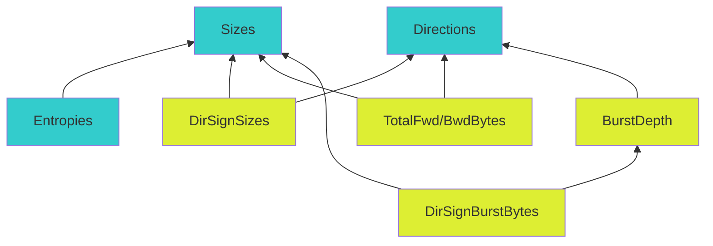

# mice-base

Repository for basic functionalities and data structures shared across the MICE project codebase.

## Features



## Build

```bash
python setup.py sdist
```

## Install

To install in an editable, debug mode run:

```bash
pip install -e .
```
